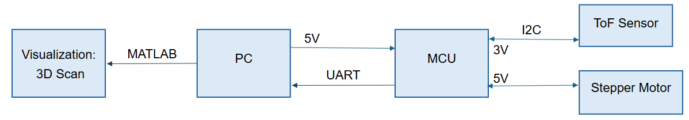
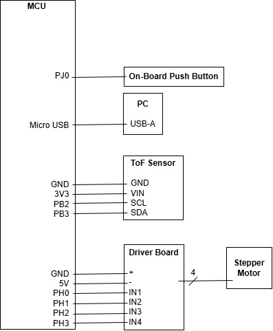
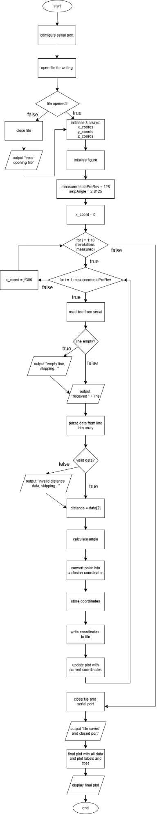

# Embedded-Spatial-Scanner
An embedded system that uses a time-of-flight sensor and a rotary mechanism to perform 360° spatial scans. It captures distance measurements within a plane, stores the data onboard, and transmits it to a PC or web app for 3D reconstruction and visualization.  #EmbeddedSystems #LiDAR #3DReconstruction

## Device Overview

### Intro

The device is an embedded spatial mapping system that uses a
Time-of-Flight (ToF) sensor (VL53L1X) mounted on a stepper motor to
perform 360° scans of its surroundings. It measures distances in the y-z
plane at fixed angular intervals and combines these with manual
displacements along the x-axis to generate 3D spatial data. The data is
transmitted to a PC via UART and visualized using MATLAB.

### Features 

- Bus Speed: 16MHz

- Operating voltage: overall system needs 2.97V - 3.63V

  - MCU: 2.97V - 3.63V (regulated from 5V PC’s USB supply)

  - ToF Sensor: 2.8V (regulated from 3.3V MCU supply)

  - Stepper Motor: 5V (from MCU supply)

- Cost: $94.26 CAD total

  - MCU: $55.47

  - ToF Sensor: $31.84

  - Stepper Motor + Driver: $6.95

- Serial communication:

  - I<sup>2</sup>C:

    - ToF to MCU

    - Address: 0x29

    - Speed: 100 kbps

    - Standard mode

  - UART:

    - MCU to PC

    - Baud: 115200 bps

    - Data format: CSV style (RangeStatus, Distance, SignalRate,
      AmbientRate, SpadNum)

- Programming:

  - C:

    - Embedded Firmware

    - Texas Instruments Code Composer Keil Studio

  - MATLAB:

    - PC Visualization

    - Converts polar ToF data to Cartesian x,y,z coordinates

- Memory:

  - Onboard RAM:

    - 256KB

    - Stores temporary measurement buffers (128 samples/revolution).

  - Data Handling:

    - MATLAB saves scans as .xyz files for 3D plotting.

    - Streaming to PC: raw data sent via UART in real-time, avoiding any
      possible MCU memory limitations

### General Description 

- Signal Acquisition:

  - ToF Principle: VL53L1X emits 940 nm laser pulses and measures time
    for reflected photons to return (SPAD array).

  - The distance is automatically calculated via: $d = \frac{1}{2} \bigtriangleup t \times c$

    - △*t* is the time it takes for the reflected photons to return.

    - *c* is the speed of light constant.

  - I²C Protocol:

    - Addressing: 0x29

    - Data Flow: MCU initiates ranging via VL53L1X\_StartRanging(),
      polls dataReady flag, and reads distance (mm) via
      VL53L1X\_GetDistance().

- Data Processing:

  - Coordinate Conversion:

    - Polar to Cartesian:

    - *y* = *d* ⋅ sin (*θ*),*z* = *d* ⋅ cos (*θ*), *x* = *n* ⋅ △*x* ,
      △*x* = 300*mm* 

    - Example: At step 512 out of 2048 (θ = 90°), distance measured =
      270mm, displacement = 1500 mm → (x, y, z) = (1500, 270, 0).

  - Trigonometric Optimization: Precomputed sin/cos lookup tables (LUTs)
    mitigate FPU limitations.

- Visualization:

  - MATLAB:

    - UART Read: serial port object with timeout handling.

    - 3D Plotting: plot3 with dynamic updates and plots data in
      real-time; data saved as .xyz file

### Block Diagram (Data flow graph)



## Device Characteristics Table

<table>
<colgroup>
<col style="width: 42%" />
<col style="width: 57%" />
</colgroup>
<thead>
<tr>
<th>Parameter</th>
<th>Note</th>
</tr>
</thead>
<tbody>
<tr>
<td>Microcontroller MSP-EXP432E401Y</td>
<td><p>ARM Cortex-M4</p>
<p>Bus speed: 16MHz</p>
<p>Communication: I<sup>2</sup>C (ToF) &amp; UART (PC)</p>
<p>--------------------------------------------------------------</p>
<p>Pins:</p>
<p>Micro USB</p>
<p>PF4: UART Tx status (LED2)</p>
<p>PN1: measurement status (LED1)</p>
<p>PN0: additional status --&gt; scanning status (LED0)</p>
<p>PJ0: on-board push button</p>
<p>PB2-3: ToF sensor</p>
<p>PH0-3: stepper motor</p>
<p>POWER: 3V3, 5V</p>
<p>x2 GND</p></td>
</tr>
<tr>
<td>VL53L1X ToF Sensor</td>
<td><p>Distance Mode: long mode (3.6 m)</p>
<p>Communication: I<sup>2</sup>C (MCU)</p>
<p>--------------------------------------------------------------</p>
<p>Pins:</p>
<p>GND</p>
<p>VIN</p>
<p>SDA</p>
<p>SCL</p></td>
</tr>
<tr>
<td><p>Stepper Motor</p>
<p>28BYJ-48 + ULN2003</p></td>
<td><p>2048 steps/revolution</p>
<p>0.175°/step</p>
<p>1ms/step</p>
<p>--------------------------------------------------------------</p>
<p>Pins:</p>
<p>+</p>
<p>-</p>
<p>IN1</p>
<p>IN2</p>
<p>IN3</p>
<p>IN4</p></td>
</tr>
<tr>
<td>PC</td>
<td><p>Port: COM4</p>
<p>Communication: UART (MCU)</p>
<p>--------------------------------------------------------------</p>
<p>Pins:</p>
<p>USB-A</p></td>
</tr>
<tr>
<td>I²C Configuration</td>
<td><p>I²C address: 0x29</p>
<p>Speed: 100 kbps</p>
<p>ToF sensor 🡪 MCU</p></td>
</tr>
<tr>
<td>UART Configuration</td>
<td><p>Port: COM4</p>
<p>Baud: 115200 bps</p>
<p>MCU 🡪 PC</p></td>
</tr>
</tbody>
</table>

## Detailed Description

### Distance Measurement 

##### Data Processing

The system converts raw ToF distance measurements (d) and stepper motor
angles (θ) into Cartesian coordinates (x,y,z) through the following
steps:

1.  Once the pushbutton is pressed, the motor rotates and pauses briefly
    for a moment so the ToF sensor can do a measurement and sends the
    data via I<sup>2</sup>C to the MCU and the MCU sends it to the PC
    via UART.

2.  The actively running MATLAB code parses the incoming data via UART
    and checks if the data is valid.

3.  If the data is invalid, it gets skipped. Otherwise, the ToF sensor’s
    distance measurement is stored as the variable ‘distance’ measured
    in mm.

4.  The angle is calculated based on the number of measurements the ToF
    sensor has done in a revolution so far and the motor’s step angle
    and stored as ‘angle’ in degrees.

5.  The y and z coordinates are calculated based on the distance and
    angle determined in steps 2 and 3.

6.  The x coordinate is calculated based on the number of revolutions
    measured so far and predefined increment between each displacement.

7.  Each coordinate is plotted in real time

8.  Once a full revolution is made, the device is manually moved
    physically forward by the user and then steps 1-7 are repeated until
    10 revolutions have been measured.

9.  The MATLAB code finishes execution and the final plot with all the
    data is displayed as a ‘MATLAB Figure’ (.fig) file.

##### Formula

The conversion calculations are shown below:

*θ* = *θ*<sub>*step*</sub> ⋅ (*i* − 1)

*y* = *d* ⋅ sin (*θ*)

*z* = *d* ⋅ cos (*θ*)

*x* = *j* ⋅ △*x*  

Where:

- *d* is the distance measured by the ToF sensor, in mm.

- *θ* is the angle of the stepper motor, in degrees.

- *θ*<sub>*step*</sub> is the stepper motor’s angle per step,
  *θ*<sub>*step*</sub> = 2.8125<sup>∘</sup>.

- *i* is the current measurement index. The –1 ensures that the first
  angle is 0°, facing forward.

- *j* is the current revolution index.

- △*x* is the default displacement increment of △*x* = 300 , in mm.

For example, if the device is currently on its 55<sup>th</sup>
measurement of its 3<sup>rd</sup> revolution and the ToF measures 172mm:

*d* = 172*mm* , *i* = 55 ,
*j* = 3 ,*θ*<sub>*step*</sub> = 2.8125<sup>∘</sup>,△*x* = 300*mm* 

*θ* = 2.8125(55 − 1) = 151.875<sup>∘</sup>

*y* = 172 ⋅ sin (151.875) = 151.58*mm*

*z* = 172 ⋅ cos (151.875) = 81.28*mm*

*x* = 3 ⋅ 300 = 900*mm* 

∴ (*x*, *y*, *z*) = (900*mm*, 151.58*mm*, 81.28*mm*)

##### Displacement

Displacement was implemented during the process using two means. The
first means is by moving the physical system forward by the displacement
increment of 300mm after each revolution scanned. The second means to
accommodate the physical adjustment is via the MATLAB code on line 96,
x\_coord = j \* 300, the displacement is 300. So, when the coordinates
are plotted in real time, after each revolution, represented by j, the x
coordinate increments by 300mm, the 3D plot also adjusts for the
physical displacement made.

### Visualization 

##### **Software Overview**

- Tool: MATLAB R2023a+ (with Instrument Control Toolbox for serial
  communication).

- Key Functions/Libraries:

  - serialport: Configures UART communication (115200 bps).

  - plot3: Real-time 3D point cloud rendering.

  - sind/cosd: Efficient polar-to-Cartesian conversion.

  - drawnow: Updates plot dynamically during data acquisition.

**Data Flow Pipeline**

MCU → UART → PC (COM4)→ Serial Port → MATLAB → Polar-to-Cartesian → 3D
Plot → .xyz File

##### **Step-by-Step Procedure**

1.  Initialization:

    ```
    s = serialport('COM4', 115200, 'Timeout', 30); % UART setup
    configureTerminator(s, "CR/LF");               % CR/LF line endings
    figure; hold on; view(3);                      %3D plot initialization
    ```

2.  Real-Time Plotting:
  
    For each measurement (128/revolution × 10 scans):

    a. Read & Parse UART Data:

    ```
    data = sscanf(x, '%u, %u, %u, %u, %u'); % Extract ToF metrics</p>
    distance = data(2);                     % Distance (mm)
    ```

    b. Coordinate Conversion:

    ```
    angle = 2.8125 * (i-1);           % i = measurement index (1-128)
    y_coord = distance * sind(angle); % Horizontal (y-axis)
    z_coord = distance * cosd(angle); % Vertical (z-axis)
    x_coord = j * 300;                % Scan plane displacement (x-axis)
    ```

    c. Plot Update:

    ```
    plot3([x_prev, x_coord], [y_prev, y_coord], [z_prev, z_coord],'-b');
    plot3(x_coord, y_coord, z_coord, 'ro', 'MarkerSize', 6); 
    drawnow; % Force immediate render
    ```

    - Blue lines: Connect consecutive points.

    - Red circles: Highlight individual measurements.


3.  Final Output:

    Results in a MATLAB Figure (.m) file that allows for interactive 3D
    rotation/zoom.

    a.  .xyz File

    Stores raw coordinates for external use:
    ```
    fprintf(f, "%.4f\t%.4f\t%.4f\n", x_coord, y_coord, z_coord);
    ```


    b. Summary Plot

    Post-processing with enhanced styling:

    ```
    plot3(x_coords, y_coords, z_coords,'-o','MarkerFaceColor','r');
    ```

## Application Note, Instructions, and Expected Output 

1.  Gather all necessary components and download all necessary files.

2.  Setup hardware

    a.  Setup ToF

        i.  Gently remove cover from over the sensor

        ii.  Attach ToF sensor to stepper motor’s rotary part ensuring
            nothing blocks/covers the sensor or its path

    b.  Wire stepper motor to driver board

        i.  Plug stepper motor’s 1x4 pin wires into 1x4 pin port of
            driver board.

    c.  Wire the driver board to the MCU (driver board to MCU
        respectively)

        i.  \+ to 5V

        ii.  \- to GND

        iii.  IN1 to PH0

        iv.  IN2 to PH1

        v.  IN3 to PH2

        vi.  IN4 to PH3

    d.  Wire the ToF sensor to the MCU (ToF senor to MCU respectively)

        i.  VIN to 3V3

        ii.  GND to GND

        iii.  SDA to PB3

        vi.  SCL to PB2

    e.  Wire PC to MCU respectively

        i.  USB-A to micro-USB

3.  Setup software

    a.  Setup MCU’s code

        i.  Open the Keil project file

        i.  In Keil, ensure to select MCU target and verify target and
            debugger settings

        iii.  In Keil, translate and build target

        vi.  In Keil, flash to the board

        v.  On MCU, press the ‘restart’ push button

        vi.  Open the MATLAB file

        vii.  Run the MATLAB file

4.  Prepare for scan

    a.  Go to scan location

    b.  Find a suitable elevated object for device placement ensuring
        steady scans

    c.  Securely place device onto object ensuring consistent position
        and direction throughout scans

    d.  Ensure nothing is obscuring the ToF sensor itself or its path

    e.  Ensure MATLAB file is still running.

    f.  In MATLAB’s command section, ensure that you see the following
        text: "Press Enter to start communication..."

    g.  Click anywhere on MATLAB’s command section window

5.  Start scan

    a.  Press enter on the PC, then immediately move onto the next step.

    b.  Press pushbutton PJ0 on MCU

    c.  On MCU, check if LED D2 is on, ensuring scan is in process.

        i.  Note that LED D1 and D3 will be flashing throughout each
            individual scan

    d.  Wait for stepper motor to stop rotating and/or wait for LED D2
        to turn off.

    e.  Steadily move object forward by 300mm without changing its
        orientation

        i.  Note that this ensures the physical increment of the
            displacement, the x coordinate, which automatically
            increments after each revolution. The X coordinate,
            orthogonal to the YZ plane, is updated after each
            revolution. The YZ plane is actively measured during the
            entire revolution.

    f.  Repeat steps 5b-5e for a maximum total of 10 times.

6.  View final results

    a.  On PC, view the MATLAB window with the 3D scan called 'Final 3D
        Visualization of ToF Sensor Data'

    b.  To do another scan, repeat steps 4a-6a.

## Limitations 

1\. Floating-Point and Trigonometric Limitations

- FPU Capability: The MSP432E401Y lacks a hardware Floating-Point Unit
  (FPU), forcing software emulation for float/double operations. This
  introduces:

  - ~10–100x slower trig calculations vs. FPU-equipped MCUs.

  - Error Accumulation: Repeated software-based sin/cos calls compound
    rounding errors (e.g., ±0.0005 rad error per call).

- Workaround: Offloaded trig to MATLAB (sind/cosd), which uses
  hardware-accelerated functions.

2\. ToF Sensor Quantization Error

- Resolution: The VL53L1X has a 1 mm resolution (per datasheet, Section
  2.4).

- Max Quantization Error:
  $error\\ = \\\frac{resolution}{2} = \\ \pm 0.5mm$

3\. Maximum UART Communication Rate

The maximum reliable UART baud rate achievable is 115,200 bps, verified
through oscilloscope measurements. This aligns with the TIA-232E
standard's 20 kbps limit (lecture week 7, slide 19) for signal integrity
over 15 meters and avoids MATLAB's serialport buffer issues. While the
MSP432E401Y supports up to 12.5 Mbps (datasheet §15.3.6), practical
constraints from clock synchronization requirements (lecture, week 7,
slide 28: "sender/receiver must use same clock speed").

4\. Microcontroller-to-ToF Communication

- Method: I²C (Standard Mode, 100 kbps).

5\. System Speed Bottlenecks & Testing

Primary Limitations

- ToF Sensor Ranging Time:

  - Typical Timing: ~33 ms/measurement in Long Mode (per VL53L1X
    datasheet section 2.5.2).

  - Confirmed via SysTick profiling:


  ```
  uint32_t start = SysTick_Value();
  VL53L1X_GetDistance(&amp;Distance); // Actual measurement: 32-35 ms
  uint32_t duration = start - SysTick_Value();
  ```

- Stepper Motor Step Delay:

  - 1.5 ms/step (empirically optimized via trial-and-error), any smaller
    than 1.5ms led to the motor not spinning

  ```
  void SysTick_WaitMinimum(uint32_t delay){
    uint32_t i;
    for(i=0; i&lt;delay; i++){
      SysTick_Wait(24000); // wait 1.5ms (assumes 16MHz clock)
    }
    return;
  }
  ```

- Hardware Limit: 28BYJ-48's 64:1 gear ratio prevents faster stepping
  without stalling.

- To prevent the mounted ToF’s wires from getting tangled, at the end of
  each revolution, the motor makes a complete rotation counterclockwise.

Total Scan Time:

 = *t*<sub>*ToF*</sub> + 2 ⋅ *t*<sub>*motor*</sub>

 = 128 ⋅ 33*ms* + 2 ⋅ 2048 ⋅ 1.5*ms* 

 = 4224*ms* + 2 ⋅ 3072*ms* 

 = 10368*ms* 

 = 10.368*s* 

Testing:

This timing was verified by measuring the time in between scans. This
was done so by using PF1 outputting a logic high once the scanning
process began and then outputting a logic low once the scan was over
while using an AD3 to measure the resulting period. The following lines
of code were added to the MCU’s main function code.

```
if (state0 == 1){
  GPIO_PORTF_DATA_R |= 0b00000010;
  getData();
  GPIO_PORTF_DATA_R &amp;= 0b11111101;
  state0 = 0;
}
```

## Circuit Schematic 



## Programming Logic Flowchart(s)

### MCU Code (C)


### PC Code (MATLAB)

