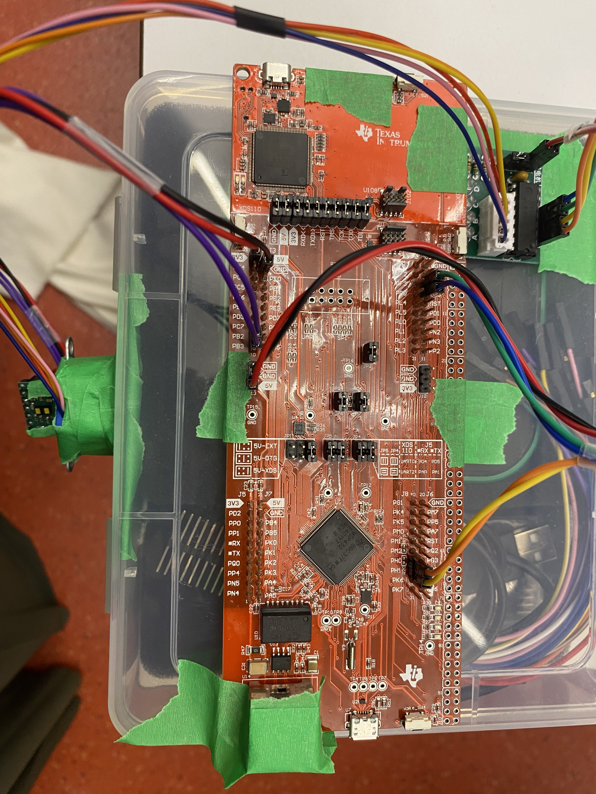
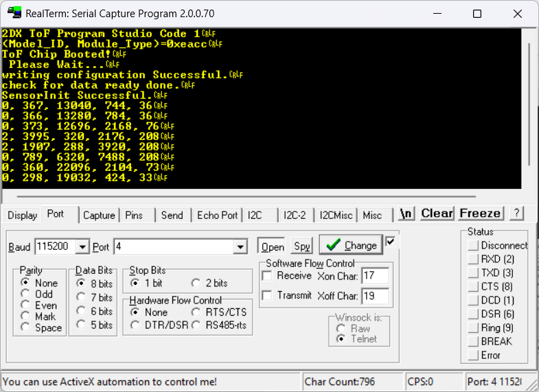
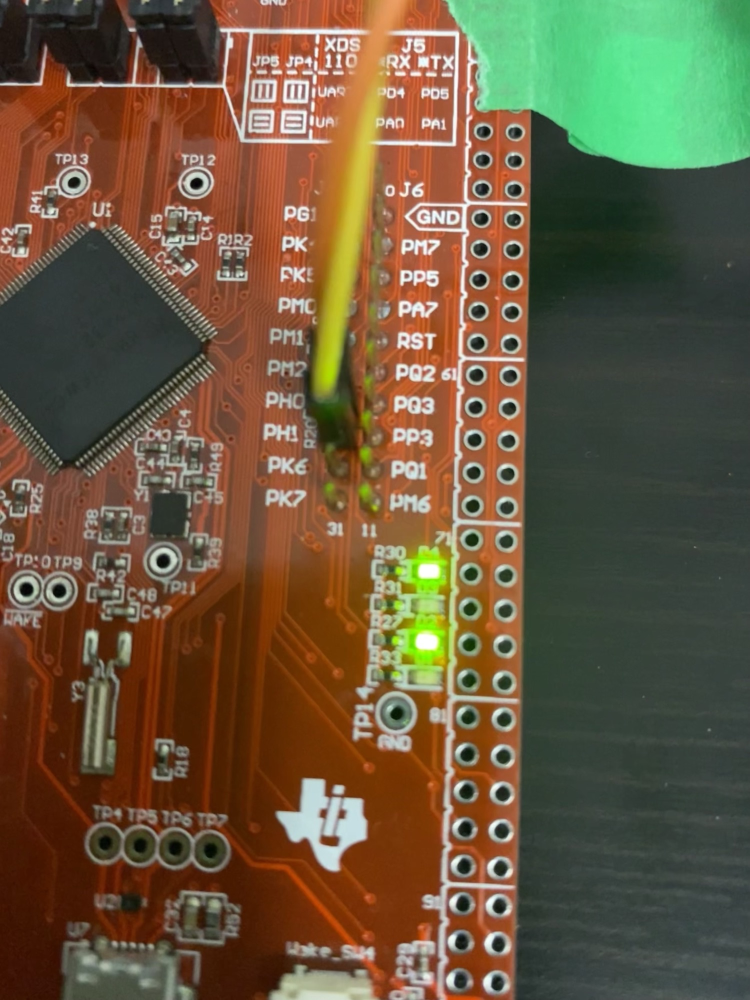

# Embedded-Spatial-Scanner

An embedded system that uses a time-of-flight sensor and a rotary mechanism to perform 360° spatial scans. It captures distance measurements within a plane, stores the data onboard, and transmits it to a PC for 3D reconstruction and visualization.


## System Overview

The device is an embedded spatial mapping system that uses a Time-of-Flight (ToF) sensor (VL53L1X) mounted on a stepper motor to perform 360° scans of its surroundings. It measures distances in the y-z plane at fixed angular intervals and combines these with manual displacements along the x-axis to generate 3D spatial data.

### Key Features

- **Bus Speed**: 16MHz
- **Operating Voltage**: 2.97V - 3.63V
  - MCU: 2.97V - 3.63V (regulated from 5V PC's USB supply)
  - ToF Sensor: 2.8V (regulated from 3.3V MCU supply)
  - Stepper Motor: 5V (from MCU supply)
- **Cost**: $94.26 CAD total
- **Communication**:
  - I²C: ToF to MCU (Address: 0x29, Speed: 100 kbps)
  - UART: MCU to PC (Baud: 115200 bps)
- **Programming**:
  - C: Embedded Firmware (Texas Instruments Code Composer Keil Studio)
  - MATLAB: PC Visualization and coordinate conversion

## Hardware Specifications

### Component Details

| Component | Specifications | Pin Connections |
|-----------|----------------|-----------------|
| **Microcontroller MSP-EXP432E401Y** | ARM Cortex-M4, 16MHz, 256KB RAM | PF4: UART Tx status (LED2)<br>PN1: measurement status (LED1)<br>PN0: scanning status (LED0)<br>PJ0: push button<br>PB2-3: ToF sensor<br>PH0-3: stepper motor |
| **VL53L1X ToF Sensor** | Long mode (3.6m range), 1mm resolution, I²C communication | VIN: 3V3<br>GND: GND<br>SDA: PB3<br>SCL: PB2 |
| **Stepper Motor 28BYJ-48 + ULN2003** | 2048 steps/revolution, 0.175°/step, 1ms/step | +: 5V<br>-: GND<br>IN1: PH0<br>IN2: PH1<br>IN3: PH2<br>IN4: PH3 |

### Circuit Schematic


## Technical Implementation

### Distance Measurement Principle

The VL53L1X emits 940 nm laser pulses and measures time for reflected photons to return using a SPAD array. Distance is calculated automatically via:

$d = \frac{1}{2} \Delta t \times c$

Where:
- $\Delta t$ = time for reflected photons to return
- $c$ = speed of light constant

### Coordinate Conversion

The system converts polar coordinates (distance + angle) to Cartesian coordinates:

**Formulas:**
- $\theta = \theta_{step} \cdot (i - 1)$
- $y = d \cdot \sin(\theta)$
- $z = d \cdot \cos(\theta)$
- $x = j \cdot \Delta x$

**Variables:**
- $d$ = distance measured by ToF sensor (mm)
- $\theta_{step}$ = 2.8125° (stepper motor angle per step)
- $i$ = current measurement index (1-128)
- $j$ = current revolution index
- $\Delta x$ = 300mm (displacement increment between revolutions)

**Example Calculation:**
For 55th measurement of 3rd revolution with d=172mm:
- $\theta = 2.8125(55-1) = 151.875°$
- $y = 172 \cdot \sin(151.875) = 151.58\text{mm}$
- $z = 172 \cdot \cos(151.875) = 81.28\text{mm}$  
- $x = 3 \cdot 300 = 900\text{mm}$
- **Result**: (900mm, 151.58mm, 81.28mm)

### Data Processing Pipeline

1. **Pushbutton pressed** → motor rotates and pauses for measurements
2. **ToF sensor measures distance** → I²C → MCU → UART → PC
3. **MATLAB parses UART data** and validates
4. **Polar to Cartesian coordinate conversion**
5. **Real-time 3D plotting**
6. **Manual displacement** by 300mm after each revolution
7. **Process repeats** for 10 revolutions

## Setup & Usage Instructions

### Hardware Assembly

#### ToF Sensor Setup


1. Gently remove cover from over the sensor
2. Attach ToF sensor to stepper motor's rotary part
3. Ensure nothing blocks/covers the sensor or its path

#### Wiring Connections

**Stepper Motor Wiring** (Driver Board → MCU):
- + to 5V
- - to GND  
- IN1 to PH0
- IN2 to PH1
- IN3 to PH2
- IN4 to PH3

**ToF Sensor Wiring** (Sensor → MCU):
- VIN to 3V3
- GND to GND
- SDA to PB3
- SCL to PB2

**PC Connection**:
- USB-A to micro-USB

### Software Configuration

#### MCU Programming
1. Open the Keil project file
2. Select MCU target and verify target/debugger settings
3. Translate and build target
4. Flash to the board
5. Press the 'restart' push button on MCU

#### MATLAB Setup
1. Open the MATLAB file
2. Run the MATLAB file

### Scanning Procedure

#### Preparation Phase
1. Place device on suitable elevated object for steady scans
2. Ensure consistent position and direction throughout scans
3. Verify nothing is obscuring the ToF sensor or its path
4. Ensure MATLAB file is running
5. In MATLAB command window, look for: "Press Enter to start communication..."

#### Execution Phase
1. Click in MATLAB's command window
2. Press Enter on PC
3. Immediately press pushbutton PJ0 on MCU
4. Verify LED D2 is on (scan in progress)
5. Note: LED D1 and D3 will flash during individual scans

#### Displacement Phase
1. Wait for stepper motor to stop rotating (or LED D2 turns off)
2. Steadily move device forward by 300mm without changing orientation
3. Repeat scan steps for maximum of 10 revolutions

#### Results Viewing
1. View MATLAB window with 3D scan: 'Final 3D Visualization of ToF Sensor Data'
2. For additional scans, repeat the procedure

## Visualization System

### MATLAB Implementation

```matlab
% UART Setup
s = serialport('COM4', 115200, 'Timeout', 30);
configureTerminator(s, "CR/LF");

% 3D Plot Initialization
figure; 
hold on; 
view(3);
title('Real-time 3D Spatial Mapping');

% Data Processing Loop
for j = 1:10  % 10 revolutions
    for i = 1:128  % 128 measurements per revolution
        % Read UART Data
        data = readline(s);
        parsed_data = sscanf(data, '%u, %u, %u, %u, %u');
        
        % Extract distance (skip if invalid)
        if parsed_data(1) == 0  % RangeStatus = 0 (valid)
            distance = parsed_data(2);
            
            % Coordinate Conversion
            angle = 2.8125 * (i-1);
            y_coord = distance * sind(angle);
            z_coord = distance * cosd(angle);
            x_coord = j * 300;
            
            % Real-time Plotting
            plot3(x_coord, y_coord, z_coord, 'ro', 'MarkerSize', 6);
            drawnow;
        end
    end
end
```

## Troubleshooting Guide

### Common Issues and Solutions

#### No Sensor Data
- **Symptom**: UART shows no distance measurements
- **Check**: I²C wiring (SDA to PB3, SCL to PB2)
- **Verify**: Sensor power (3V3 and GND)
- **Ensure**: Sensor cover is removed
- **Debug**: Use LED indicators to verify sensor communication

#### Motor Not Rotating
- **Symptom**: Stepper motor doesn't move during scan
- **Check**: Motor driver wiring (IN1-IN4 to PH0-PH3)
- **Verify**: Power connections (5V and GND)
- **Confirm**: Step delay settings in code

#### MATLAB Communication Issues
- **Symptom**: No data received in MATLAB
- **Verify**: COM port settings (typically COM4)
- **Check**: Baud rate: 115200
- **Ensure**: Proper line termination (CR/LF)

### LED Status Indicators
- **LED D2**: Scan in progress (ON during active scanning)
- **LED D1**: Measurement activity (flashes during readings)
- **LED D3**: Additional status (flashes during processing)

### Debugging Example


## System Limitations

### Processing Constraints
- **No hardware FPU** on MSP432E401Y microcontroller
- **Software emulation** for float/double operations (10-100x slower)
- **Trigonometric calculations** performed in MATLAB
- **Limited onboard RAM** (256KB) for measurement buffers

### Physical Constraints
- **Manual displacement** required between scans
- **Maximum reliable scanning distance**: 3.6m
- **Requires stable mounting platform**
- **Stepper motor gear ratio** (64:1) limits stepping speed

### Environmental Factors
- **Lighting conditions** may affect performance
- **Reflective surfaces** can impact distance measurements
- **Ambient infrared sources** may interfere with readings
- **Wire management** required to prevent tangling

## File Structure
    Embedded-Spatial-Scanner/
    ├── firmware/ # MCU source code
    │ ├── main.c # Main application logic
    │ ├── motor_control.c # Stepper motor functions
    │ ├── sensor_interface.c # ToF sensor communication
    │ └── uart_handler.c # Serial communication
    ├── matlab/
    │ ├── visualization.m # Main 3D plotting script
    │ ├── data_parser.m # UART data parsing
    │ └── coordinate_conv.m # Polar to Cartesian conversion
    ├── docs/
    │ ├── schematics/ # Circuit diagrams
    │ ├── datasheets/ # Component specifications
    │ └── pin_mappings.md # Pin connection reference
    ├── media/ # Images and diagrams
    │ ├── image1.png # Block diagram
    │ ├── image2.jpg # Circuit schematic
    │ ├── image3.png # MCU flowchart
    │ └── image4.png # MATLAB flowchart
    └── README.md # This file


## Dependencies & Requirements

### Software Requirements
- **Texas Instruments Code Composer Studio** or **Keil MDK**
- **MATLAB R2023a+** with Instrument Control Toolbox
- **Embedded C compiler** for ARM Cortex-M4
- **Serial terminal software** (for debugging)

### Hardware Requirements
- MSP-EXP432E401Y LaunchPad
- VL53L1X Time-of-Flight sensor
- 28BYJ-48 stepper motor with ULN2003 driver
- USB cable for programming and data transfer
- Breadboard and jumper wires for connections

## Applications

- **3D environment mapping** and spatial analysis
- **Room dimension measurement** and layout planning
- **Object detection** and profiling
- **Educational demonstrations** of embedded systems
- **Prototyping platform** for autonomous navigation systems
- **Industrial metrology** and quality control

## Future Enhancements

### Hardware Improvements
- **Automated displacement mechanism** for continuous scanning
- **Wireless data transmission** (Bluetooth/Wi-Fi)
- **Multiple sensor integration** for improved coverage
- **Motor encoders** for precise position feedback

### Software Enhancements
- **Real-time web visualization** interface
- **Edge computing** for on-device processing
- **Advanced filtering algorithms** for noise reduction
- **Point cloud processing** for object recognition

### System Upgrades
- **Battery power** for portable operation
- **Waterproof enclosure** for outdoor use
- **Motorized elevation control** for 3D volumetric scanning
- **Integration with SLAM algorithms** for simultaneous localization and mapping

## Support & Documentation

For technical issues or questions about this project:

1. **Check the `/docs` folder** for detailed documentation
2. **Review component datasheets** for technical specifications
3. **Examine the example outputs** in the media folder
4. **Verify all connections** against the pin mapping table

### Typical Output Results


---
*Project developed for embedded systems applications and 3D spatial mapping - McMaster University*